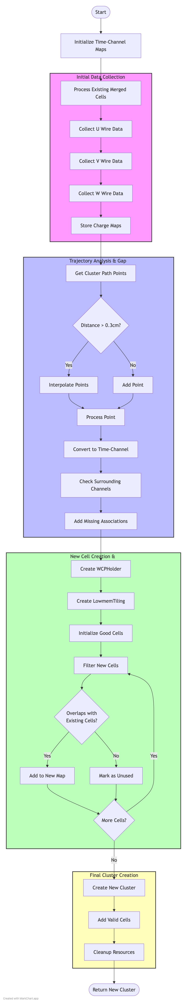

# Improve_PR3DCluster Function Documentation

## Overview
The [`Improve_PR3DCluster`](https://github.com/BNLIF/wire-cell/blob/master/uboone_nusel_app/apps/prod-wire-cell-matching-nusel.cxx#L828) function is designed to enhance a 3D cluster reconstruction in Wire-Cell Toolkit by filling in missing pieces and improving connectivity between cells. It takes an existing PR3DCluster and attempts to improve it by analyzing trajectory points and adding missing wire associations.

## Function Signature
```cpp
WCP::PR3DCluster* Improve_PR3DCluster(
    WCP::PR3DCluster* cluster,                  // Input cluster to improve
    WCP::ToyCTPointCloud& ct_point_cloud,       // Point cloud for coordinate transformation
    WCPSst::GeomDataSource& gds                 // Geometry data source
)
```

## Input Parameters
1. **cluster**: A pointer to the original PR3DCluster that needs improvement
2. **ct_point_cloud**: A ToyCTPointCloud object that handles coordinate transformations
3. **gds**: GeomDataSource object containing detector geometry information

## Output
Returns a new PR3DCluster pointer containing the improved cluster with better connectivity and filled gaps.

## Algorithm Steps

### Flow Diagram

The complete algorithm flow is visualized in [Improve_PR3DCluster_logic.md](Improve_PR3DCluster_logic.md):


### 1. Initial Data Collection
- Creates maps to store time-channel associations for U, V, and W wire planes
- Builds maps for time-channel charge and charge error information
- Processes existing merged cells (MCells) from input cluster
```cpp
std::map<int,std::set<int>> u_time_chs; // time -> channel mappings for U plane
std::map<int,std::set<int>> v_time_chs; // time -> channel mappings for V plane
std::map<int,std::set<int>> w_time_chs; // time -> channel mappings for W plane
std::map<std::pair<int,int>,double> time_ch_charge_map;
std::map<std::pair<int,int>,double> time_ch_charge_err_map;
```

### 2. Trajectory Analysis
- Extracts path points from cluster's trajectory
- Interpolates between points if distance exceeds threshold (0.3 cm)
- Creates denser point cloud for better coverage
```cpp
double low_dis_limit = 0.3*units::cm;
// Interpolation logic when distance > threshold
if (dis < low_dis_limit ){
    path_pts.push_back(p);
} else {
    int ncount = int(dis/low_dis_limit)+1;
    // Add interpolated points
}
```

### 3. Gap Filling
- For each trajectory point:
  - Converts 3D coordinates to time-channel space
  - Checks surrounding channels (+/- 3 channels) in each plane
  - Adds missing time-channel associations
  - Sets charge to 0 for newly added associations
```cpp
for (int time_slice = results.at(0)-3; time_slice<=results.at(0)+3; time_slice ++){
    // Add channels within +/- 3 range for each plane
    // Check channel limits and Manhattan distance
    // Add new time-channel pairs with 0 charge if missing
}
```

### 4. New Cell Creation
- Creates new merged cells using WCPHolder and LowmemTiling
- Processes each time slice to create improved cell structure
```cpp
WCP2dToy::WCPHolder *WCholder = new WCPHolder();
for (auto it = u_time_chs.begin(); it!= u_time_chs.end(); it++){
    int time_slice = it->first;
    WCP2dToy::LowmemTiling tiling(time_slice,gds,*WCholder);
    tiling.init_good_cells(u_time_chs, v_time_chs, w_time_chs);  
}
```

### 5. Cell Filtering
- Filters newly created cells based on overlap with existing cells
- Checks overlap in current, previous, and next time slices
- Builds new time-to-cell mapping for valid cells
```cpp
// Check overlap with cells in adjacent time slices
if (old_time_mcells_map.find(time_slice-1) != old_time_mcells_map.end()){
    for (auto it1 = old_time_mcells_map[time_slice-1].begin(); 
         it1!=old_time_mcells_map[time_slice-1].end(); it1++){
        if (mcell->Overlap_fast((*it1))){
            flag_good = true;
            break;
        }
    }
}
```

### 6. Final Cluster Creation
- Creates new PR3DCluster with improved cell structure
- Adds filtered and validated cells to new cluster
- Returns improved cluster
```cpp
PR3DCluster *new_cluster = new PR3DCluster(cluster->get_cluster_id());
for (auto it = new_time_mcells_map.begin(); it!= new_time_mcells_map.end(); it++){
    int time_slice = it->first;
    SMGCSelection& temp_mcells = it->second;
    for (auto it1 = temp_mcells.begin(); it1!=temp_mcells.end(); it1++){
        SlimMergeGeomCell *mcell = (*it1);
        new_cluster->AddCell(mcell,time_slice);
    }
}
```

## Example Usage

```cpp
#include "WCP2dToy/ImprovePR3DCluster.h"

// Initialize required objects
WCP::PR3DCluster* original_cluster = /* your cluster */;
WCP::ToyCTPointCloud ct_point_cloud(/* params */);
WCPSst::GeomDataSource gds(/* geometry params */);

// Improve the cluster
WCP::PR3DCluster* improved_cluster = WCP2dToy::Improve_PR3DCluster(
    original_cluster,
    ct_point_cloud,
    gds
);

// Use improved cluster for further processing
// Remember to delete improved_cluster when done
```

## Important Notes
1. The function creates a new cluster rather than modifying the input cluster
2. Memory management is important - the caller is responsible for deleting the returned cluster
3. The improvement process focuses on both spatial and temporal connectivity
4. Zero charge is assigned to newly added time-channel pairs
5. The function uses a 3-channel window for neighboring channel associations
