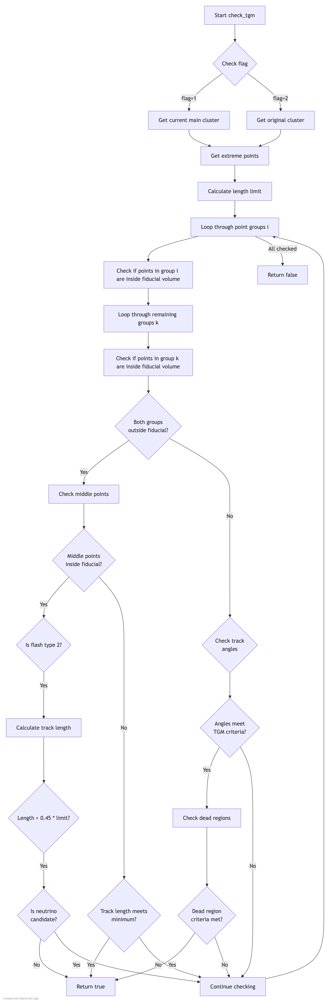

# Through-Going Muon (TGM) Check Documentation

## Overview
The `check_tgm` function is designed to identify through-going muons in particle detector events. It analyzes track geometry and characteristics to determine if a particle track is likely a through-going muon rather than a neutrino interaction.

## Function Signature
```cpp
bool WCP2dToy::ToyFiducial::check_tgm(
    WCP::FlashTPCBundle *bundle,
    double offset_x,
    WCP::ToyCTPointCloud& ct_point_cloud,
    std::map<PR3DCluster*, PR3DCluster*>& old_new_cluster_map,
    int flag
)
```

## Inputs
- `bundle`: A FlashTPCBundle containing the main cluster and flash information
- `offset_x`: X-axis offset for position corrections
- `ct_point_cloud`: Point cloud data structure for track analysis
- `old_new_cluster_map`: Map of clusters for dead channel corrections
- `flag`: Control flag (1 = check current cluster, 2 = check original cluster)

## Output
- Returns `true` if the track is identified as a through-going muon
- Returns `false` otherwise

## Key Dependencies
The function relies on several other functions and utilities:
1. `inside_fiducial_volume()`: Checks if points are within detector boundaries. See detailed documentation [here](inside_fiducial_volume.md)
2. `check_neutrino_candidate()`: Analyzes if track characteristics match neutrino interaction patterns
3. `check_signal_processing()`: Validates signal processing aspects of track
4. `check_dead_volume()`: Checks track interaction with detector dead regions
5. `VHoughTrans()`: Performs Hough transform for direction analysis

## Algorithm Steps

### Flow Diagram

The complete algorithm flow is visualized in [check_tgm_logic.md](check_tgm_logic.md):




1. **Initial Setup**
   - Get main cluster and flash data from bundle
   - Extract extreme points (endpoints) of tracks
   - Set up direction vectors for track analysis

2. **Track Length Analysis**
   ```cpp
   double length_limit = sqrt(pow(out_vec_wcps.at(0).at(0).x-out_vec_wcps.at(1).at(0).x,2)+
                            pow(out_vec_wcps.at(0).at(0).y-out_vec_wcps.at(1).at(0).y,2)+
                            pow(out_vec_wcps.at(0).at(0).z-out_vec_wcps.at(1).at(0).z,2));
   ```

3. **Point Analysis Loop**
   - Iterate through track points
   - Check if points are inside fiducial volume
   - Analyze point distributions and patterns

4. **TGM Identification Criteria**
   The function identifies a track as TGM if it meets any of these conditions:
   - Track endpoints are outside fiducial volume with middle points inside
   - Track geometry matches TGM patterns (specific angles and lengths)
   - Track doesn't match neutrino interaction characteristics

5. **Special Cases**
   - Handles beam timing (flash type 2) differently
   - Considers track length relative to total length (0.45 * length_limit)
   - Takes into account detector dead regions

## Example Usage
```cpp
WCP::FlashTPCBundle* bundle = /* initialize bundle */;
double offset_x = /* set offset */;
WCP::ToyCTPointCloud ct_point_cloud;
std::map<PR3DCluster*, PR3DCluster*> cluster_map;

WCP2dToy::ToyFiducial fiducial;
bool is_tgm = fiducial.check_tgm(bundle, offset_x, ct_point_cloud, cluster_map, 1);
```

## Key Parameters and Thresholds

- **Angle Thresholds:**
  - 60° for primary track angle checks
  - 10° for U/V plane checks
  - 5° for W plane checks

- **Length Thresholds:**
  - 0.45 * length_limit for minimum track length consideration
  - Various unit-based measurements (units::cm)

## Performance Considerations

1. **Computational Intensity**
   - Multiple geometric calculations
   - Point cloud operations
   - Dead region checks

2. **Memory Usage**
   - Stores track points and vectors
   - Maintains cluster maps
   - Point cloud data structures

## Error Handling
- Handles null clusters
- Validates point existence
- Checks boundary conditions

## Limitations
1. Assumes specific detector geometry
2. Requires accurate flash timing
3. Dependent on point cloud quality
4. Limited by dead region information accuracy