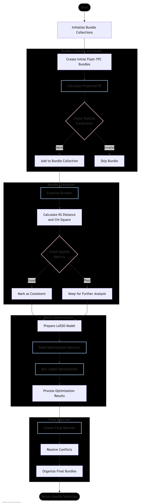

# TPC Light Matching Algorithm Documentation

## Overview
The `tpc_light_match` function implements a sophisticated matching algorithm between Time Projection Chamber (TPC) detector clusters and light flashes detected by photomultiplier tubes (PMTs) in neutrino experiments. This matching process is essential for correlating particle tracks with their corresponding light signals.

## Function Signature
```cpp
WCP::FlashTPCBundleSelection tpc_light_match(
    double eventTime,           // Event timestamp
    int time_offset,           // Time offset in microseconds
    int nrebin,               // Number of rebinning steps
    WCP::Photon_Library *pl,  // Photon library containing PMT response data
    WCP::map_cluster_cluster_vec& group_clusters,  // Map of cluster groups
    WCP::OpflashSelection& flashes,  // Collection of optical flashes
    Int_t runno = 0,          // Run number
    bool flag_data = true,    // Real data vs simulation flag
    bool flag_add_light_yield_err = false,  // Light yield error flag
    bool flag_timestamp = false  // Timestamp processing flag
);
```

## Data Structures

### Key Input Types
- `FlashTPCBundle`: A container for a matched flash-TPC pair
- `OpflashSelection`: Collection of optical flashes
- `Photon_Library`: Contains PMT response data and mapping information
- `PR3DCluster`: Represents a 3D cluster in the TPC

## Algorithm Flow

### Flow Diagram

The complete algorithm flow is visualized in [ToyMatching_logic.md](ToyMatching_logic.md):



The diagram shows the key stages:
1. Bundle Creation and Initial Filtering
2. Bundle Evaluation
3. Match Optimization
4. Final Selection

### 1. Bundle Creation and Initial Filtering

The algorithm begins by creating potential flash-TPC cluster pairs (bundles) and calculating predicted light signals:

```cpp
for (auto it1 = flashes.begin(); it1!=flashes.end(); it1++){
    Opflash *flash = (*it1);
    double offset_x = (flash->get_time() - time_offset)*2./nrebin*time_slice_width;
    
    for (auto it2 = group_clusters.begin(); it2!=group_clusters.end(); it2++){
        PR3DCluster* main_cluster = it2->first;
        FlashTPCBundle *bundle = new FlashTPCBundle(flash, main_cluster, 
                                                  flash_index_id, cluster_index_id);
        bool flag_good_bundle = false;
        
        // Calculate predicted PE for this bundle
        calculate_pred_pe(run_no, eventTime, time_offset, nrebin, 
                        time_slice_width, pl, bundle, &pred_pmt_light,
                        &additional_clusters, &other_clusters, 
                        &more_clusters, flag_good_bundle, flag_data, 
                        flag_timestamp);
```

### 2. Bundle Evaluation

Each bundle is evaluated using multiple metrics:

```cpp
if (!bundle->examine_bundle(cos_pe_low, cos_pe_mid)){
    to_be_removed.push_back(bundle);
}

// KS test and chi-square criteria
if (bundle->get_ks_dis()<0.07 && bundle->get_ndf()>=10 && 
    bundle->get_chi2() < bundle->get_ndf() * 60){
    bundle->set_consistent_flag(true);
    flag_tight_bundle = true;
}
```

### 3. Match Optimization

The algorithm uses a LASSO model for optimization:

```cpp
// Set up optimization matrices
VectorXd M = VectorXd::Zero(32*flash_bundles_map.size());
MatrixXd R = MatrixXd::Zero(32*flash_bundles_map.size(), num_unknowns);
VectorXd MF = VectorXd::Zero(map_tpc_index.size());
MatrixXd RF = MatrixXd::Zero(map_tpc_index.size(), num_unknowns);

// Configure LASSO model
WCP::LassoModel m2(lambda, 100000, 0.01);
m2.SetData(G, W);
for (size_t i=0; i!=total_weights.size(); i++){
    m2.SetLambdaWeight(i,total_weights.at(i));
}
m2.Fit();
```

### 4. Special Case Handling

The algorithm includes specific handling for edge cases:

```cpp
// Handle clusters near boundaries
if (first_pos_x-offset_x <= low_x_cut + low_x_cut_ext2 && 
    first_pos_x-offset_x > low_x_cut + low_x_cut_ext1 - 1.0*units::cm){
    bundle->set_flag_close_to_PMT(true);
    bundle->set_flag_at_x_boundary(true);
}

// Additional checks for beam flashes
if (flash->get_type()==2){ // beam flash
    if (consistent_bundles.size()==0){
        if (min_bundle->examine_beam_bundle())
            min_bundle->set_consistent_flag(true);
    }
}
```

## Results Processing

### Final Match Selection
The algorithm creates final matches based on optimization results:

```cpp
std::map<int,std::pair<Opflash*,double>> matched_pairs;
for (size_t i=0; i!=total_pairs.size(); i++){
    if(beta(i)!=0){
        int tpc_index = map_tpc_index[total_pairs.at(i).second];
        Opflash *flash = total_pairs.at(i).first;
        if (matched_pairs.find(tpc_index)==matched_pairs.end()){
            matched_pairs[tpc_index] = std::make_pair(flash,beta(i));
        }else if (beta(i) > matched_pairs[tpc_index].second){
            matched_pairs[tpc_index] = std::make_pair(flash,beta(i));
        }
    }
}
```

### Output Bundle Creation
Final bundles are created and organized:

```cpp
FlashTPCBundleSelection results_bundles;
for (auto it = group_clusters.begin(); it!=group_clusters.end(); it++){
    PR3DCluster* main_cluster = it->first;
    if (map_tpc_index.find(main_cluster)!=map_tpc_index.end()){
        int tpc_index = map_tpc_index[main_cluster];
        if (matched_pairs.find(tpc_index)!=matched_pairs.end()){
            Opflash* flash = matched_pairs[tpc_index].first;
            double strength = matched_pairs[tpc_index].second;
            FlashTPCBundle* bundle = fc_bundles_map[std::make_pair(flash,main_cluster)];
            bundle->set_strength(strength);
            results_bundles_set.insert(bundle);
        }
    }
}
```

## Key Features

1. **Robust Matching**
   - Handles multiple potential matches through scoring
   - Considers both spatial and temporal correlations
   - Includes PMT response patterns in matching criteria

2. **Error Handling**
   - Accounts for light yield uncertainties
   - Handles boundary cases and PMT proximity
   - Includes specific handling for beam-related flashes

3. **Optimization**
   - Uses regularized optimization (LASSO)
   - Balances multiple constraints and criteria
   - Handles ambiguous matches through weighted scoring

## Performance Considerations

- The algorithm uses multiple passes to refine matches
- Includes specific optimizations for beam-related flashes
- Handles edge cases near detector boundaries
- Considers PMT response patterns and uncertainties

This algorithm is particularly useful in neutrino experiments where accurate matching of TPC tracks with light signals is crucial for event reconstruction and analysis.