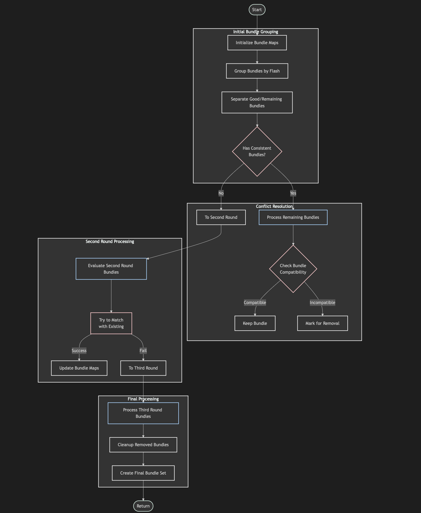

# organize_matched_bundles Function Documentation

## Overview
The `organize_matched_bundles` function is responsible for organizing and refining the matches between TPC clusters and light flashes. It handles ambiguous matches, resolves conflicts, and ensures the final selection of bundles meets quality criteria.

## Function Signature
```cpp
void organize_matched_bundles(
    WCP::FlashTPCBundleSelection& results_bundles,  // Input/Output bundle collection
    Double_t *cos_pe_low,                           // Lower PE thresholds
    Double_t *cos_pe_mid,                           // Middle PE thresholds
    std::map<std::pair<WCP::Opflash*,WCP::PR3DCluster*>,
             WCP::FlashTPCBundle*>& fc_bundles_map  // Flash-cluster bundle mapping
);
```

## Key Data Structures

### Input Maps and Collections
```cpp
Flash_bundles_map flash_bundles_map;        // Maps flashes to bundles
Cluster_bundles_map cluster_bundles_map;    // Maps clusters to bundles
FlashTPCBundleSelection good_bundles;       // Collection of good matches
FlashTPCBundleSelection second_round_bundles; // Bundles for second evaluation
FlashTPCBundleSelection third_round_bundles;  // Bundles for third evaluation
```

## Main Algorithm Steps

### Flow Diagram

The complete algorithm flow is visualized in [ToyMatching_organize_bundle_logic.md](ToyMatching_organize_bundle_logic.md):



### 1. Initial Bundle Organization
```cpp
// Group bundles by flash
for (auto it = results_bundles.begin(); it!= results_bundles.end(); it++){
    FlashTPCBundle *bundle = (*it);
    Opflash *flash = bundle->get_flash();
    if (flash!=0){
        if (flash_bundles_map.find(flash)==flash_bundles_map.end()){
            FlashTPCBundleSelection bundles;
            bundles.push_back(bundle);
            flash_bundles_map[flash] = bundles;
        } else {
            flash_bundles_map[flash].push_back(bundle);
        }
    }
}
```

### 2. Bundle Quality Assessment
For each flash, the function evaluates bundle quality:
```cpp
for (auto it = flash_bundles_map.begin(); it!=flash_bundles_map.end(); it++){
    Opflash *flash = it->first;
    FlashTPCBundleSelection& bundles = it->second;
    FlashTPCBundleSelection consistent_bundles;
    FlashTPCBundleSelection remaining_bundles;
    
    // Separate bundles based on consistency
    for (auto it1 = bundles.begin(); it1!=bundles.end(); it1++){
        FlashTPCBundle *bundle = *it1;
        if (bundle->get_consistent_flag()){
            consistent_bundles.push_back(bundle);
        } else {
            remaining_bundles.push_back(bundle);
        }
    }
}
```

### 3. Bundle Conflict Resolution
```cpp
if (consistent_bundles.size()>0){
    for (auto it1 = remaining_bundles.begin(); it1!=remaining_bundles.end(); it1++){
        FlashTPCBundle *bundle1 = *it1;
        bool flag_remove = true;
        
        // Check compatibility with consistent bundles
        for (auto it2 = consistent_bundles.begin(); 
             it2!=consistent_bundles.end(); it2++){
            FlashTPCBundle *bundle2 = *it2;
            if (bundle2->examine_bundle(bundle1, cos_pe_low, cos_pe_mid)){
                flag_remove = false;
                break;
            }
        }
        
        if (flag_remove)
            to_be_removed.push_back(bundle1);
    }
}
```

### 4. Multi-Round Evaluation
The function processes bundles in multiple rounds:
- First round: Evaluates primary matches
- Second round: Processes remaining potential matches
- Third round: Final evaluation of unmatched bundles

```cpp
// Process second round bundles
for (auto it = second_round_bundles.begin(); 
     it!=second_round_bundles.end(); it++){
    FlashTPCBundle *bundle = (*it);
    PR3DCluster *main_cluster = bundle->get_main_cluster();
    bool flag_used = false;
    
    // Try to match with existing bundles
    for (auto it1 = results_bundles.rbegin(); 
         it1!=results_bundles.rend(); it1++){
        FlashTPCBundle *best_bundle = (*it1);
        // ... evaluation logic
    }
}
```

### 5. Final Bundle Selection
```cpp
// Create final bundle set
FlashTPCBundleSet remaining_bundles(results_bundles.begin(), 
                                   results_bundles.end());
results_bundles.clear();
std::copy(remaining_bundles.begin(), remaining_bundles.end(), 
          std::back_inserter(results_bundles));
```

## Quality Criteria

### Bundle Consistency Checks
- KS distance thresholds
- Chi-square test values
- PMT response patterns
- Position relative to detector boundaries

### Conflict Resolution Rules
1. Priority to bundles with consistent flags
2. Evaluation of bundle quality metrics
3. Consideration of detector geometry
4. PMT response compatibility

## Error Handling

- Handles missing flashes or clusters
- Manages boundary cases
- Resolves conflicting matches
- Cleans up removed bundles