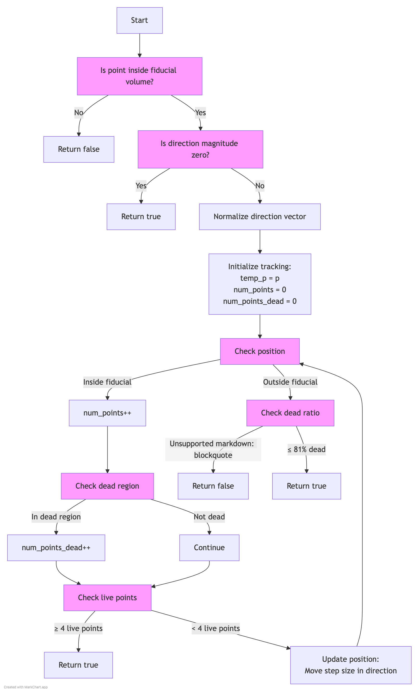

# ToyFiducial::check_dead_volume Documentation

## Function Purpose
The `check_dead_volume()` function evaluates whether a given trajectory passes through too many dead regions in the detector. This helps identify tracks that might be unreliable due to dead or problematic detector regions.

## Function Signature
```cpp
bool check_dead_volume(WCP::Point& p, TVector3& dir, double step = 1.0*units::cm, double offset_x = 0)
```

## Input Parameters
- `p`: The starting point to check (WCP::Point)
- `dir`: Direction vector for the trajectory (TVector3)
- `step`: Step size for sampling points along trajectory (default: 1 cm)
- `offset_x`: X-coordinate offset for fiducial volume checks (default: 0)

## Return Value
- Returns `false` if:
  - Starting point is outside fiducial volume
  - More than 81% of sampled points are in dead regions
- Returns `true` if:
  - Direction magnitude is zero
  - Sufficient good points found along trajectory

## Algorithm Logic

### Flow Diagram

The complete algorithm flow is visualized in [check_dead_volume_logic.md](check_dead_volume_logic.md):


1. **Initial Checks**
   - Verifies if starting point is inside fiducial volume
   - Checks if direction vector has zero magnitude
   - Normalizes direction vector if non-zero

2. **Point Sampling**
   - Steps along trajectory from starting point
   - Uses specified step size
   - Continues while inside fiducial volume

3. **Dead Region Analysis**
   - Counts total points sampled
   - Counts points in dead regions
   - Returns true if 4 good points found
   - Evaluates final ratio of dead points to total points

4. **Final Assessment**
   - If >81% points are in dead regions, returns false
   - Otherwise returns true

## Example Usage

```cpp
// Basic usage
WCP::Point start_point(10*units::cm, 20*units::cm, 30*units::cm);
TVector3 direction(1, 0, 0);  // Moving along x-axis
bool is_valid = fid.check_dead_volume(start_point, direction);

// With custom parameters
double step_size = 0.5*units::cm;
double x_offset = 5*units::cm;
bool is_valid = fid.check_dead_volume(start_point, direction, 
                                    step_size, x_offset);
```

## Common Use Cases

1. **Track Validation**
```cpp
// Validate track doesn't pass through too many dead regions
WCP::Point track_start = track->get_start_point();
TVector3 track_dir = track->get_direction();
bool is_track_valid = fid.check_dead_volume(track_start, track_dir);
```

2. **Multi-Direction Check**
```cpp
// Check multiple possible directions
std::vector<TVector3> directions = {
    TVector3(1,0,0),
    TVector3(0,1,0),
    TVector3(0,0,1)
};

for(const auto& dir : directions) {
    if(fid.check_dead_volume(point, dir)) {
        // Found valid direction
        break;
    }
}
```

## Key Differences from check_signal_processing

1. **Threshold Values**
   - Uses 81% dead point threshold (vs 80% in signal processing)
   - Requires 4 good points (vs 5 in signal processing)
   - Only checks dead regions (vs signal points in multiple planes)

2. **Complexity**
   - Simpler implementation
   - No point cloud checks
   - Only uses internal dead region mapping

## Performance Considerations

1. **Computation Cost**
   - Main cost is in dead region checks
   - Number of iterations depends on:
     - Fiducial volume size
     - Step size
     - Direction vector

2. **Memory Usage**
   - Minimal memory footprint
   - Only stores counters and temporary point

## Common Issues and Solutions

1. **Always Returns False**
   - Check if point is in fiducial volume
   - Verify direction vector is valid
   - Confirm dead region mapping is correct

2. **Unexpected Results**
   - Verify step size is appropriate
   - Check x_offset value
   - Confirm dead region definitions

3. **Performance Issues**
   - Increase step size
   - Optimize dead region lookup
   - Consider region of interest restrictions