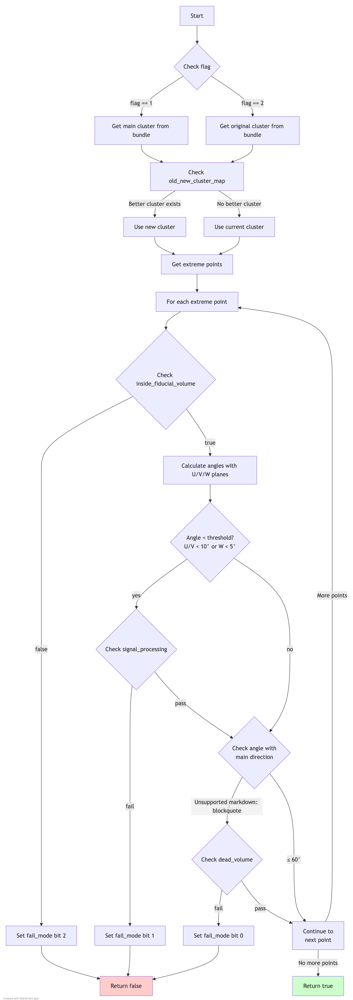

# check_fully_contained Function Documentation

## Overview
The `check_fully_contained` function is part of the `ToyFiducial` class in the Wire-Cell Toolkit. It checks whether a particle cluster is fully contained within the detector's fiducial volume, taking into account dead regions and signal processing requirements.

## Function Signature
```cpp
bool check_fully_contained(
    WCP::FlashTPCBundle *bundle,
    double offset_x,
    WCP::ToyCTPointCloud& ct_point_cloud,
    std::map<WCP::PR3DCluster*, WCP::PR3DCluster*>& old_new_cluster_map,
    unsigned int* fail_mode = nullptr,
    int flag = 1
)
```

## Input Parameters
- `bundle`: Pointer to a FlashTPCBundle object containing cluster and flash information
- `offset_x`: X-axis offset value for drift correction
- `ct_point_cloud`: Reference to a ToyCTPointCloud object containing point cloud data
- `old_new_cluster_map`: Map between old and new PR3DCluster objects
- `fail_mode`: Optional pointer to unsigned int for failure mode tracking
- `flag`: Flag to determine which cluster to check (1 for current, 2 for original)

## Output
Returns a boolean value:
- `true`: Cluster is fully contained
- `false`: Cluster is not fully contained

## Failure Modes
The function uses bit flags to track different failure modes:
- Bit 0: Dead volume check failure
- Bit 1: Signal processing check failure
- Bit 2: Fiducial volume boundary check failure

## Algorithm Steps

### Flow Diagram

The complete algorithm flow is visualized in [check_fully_contained_logic.md](check_fully_contained_logic.md):


1. **Cluster Selection**
   - Based on the flag value (1 or 2), selects either the current main cluster or original cluster
   - If a better cluster exists in the old_new_cluster_map, uses that instead

2. **Extreme Points Analysis**
   - Gets extreme points of the cluster using `get_extreme_wcps()`
   - These points represent the endpoints or vertices of the cluster

3. **Direction Vectors Setup**
   - Defines key direction vectors:
     - Drift direction (1,0,0)
     - U-wire direction (0,cos(60°),sin(60°))
     - V-wire direction (0,cos(60°),-sin(60°))
     - W-wire direction (0,1,0)
   - Gets main cluster direction using PCA axis

4. **Point-by-Point Checks**
   For each extreme point:
   - Checks if point is inside fiducial volume
   - Gets local direction using VHoughTrans
   - Calculates angles with U, V, W directions
   - Performs signal processing and dead volume checks based on angles

## Helper Functions Called

1. **inside_fiducial_volume**
   - Checks if a point is within detector boundaries
   - Parameters: Point coordinates, X offset

2. **check_signal_processing**
   - Verifies signal processing requirements
   - Parameters: Point, direction, point cloud, step size, X offset

3. **check_dead_volume**
   - Checks for dead detector regions
   - Parameters: Point, direction, step size, X offset

4. **VHoughTrans**
   - Calculates local direction using Hough transform
   - Parameters: Point, distance threshold

## Example Usage

```cpp
WCP::FlashTPCBundle* bundle = /* initialize bundle */;
double offset_x = 10.0;
WCP::ToyCTPointCloud ct_point_cloud;
std::map<WCP::PR3DCluster*, WCP::PR3DCluster*> cluster_map;
unsigned int fail_mode = 0;

WCP2dToy::ToyFiducial fiducial;
bool is_contained = fiducial.check_fully_contained(
    bundle,
    offset_x,
    ct_point_cloud,
    cluster_map,
    &fail_mode,
    1
);

if (!is_contained) {
    if (fail_mode & (1U << 0)) {
        std::cout << "Failed dead volume check" << std::endl;
    }
    if (fail_mode & (1U << 1)) {
        std::cout << "Failed signal processing check" << std::endl;
    }
    if (fail_mode & (1U << 2)) {
        std::cout << "Failed fiducial volume check" << std::endl;
    }
}
```

## Important Considerations

1. **Performance**
   - The function performs multiple geometric calculations
   - Efficiency depends on cluster size and complexity

2. **Angle Thresholds**
   - Uses specific angle thresholds for different checks:
     - U/V plane: < 10 degrees
     - W plane: < 5 degrees
     - Main direction: > 60 degrees

3. **Step Sizes**
   - Uses 1 cm step size for signal processing and dead volume checks
   - Uses 30 cm distance for direction calculations

4. **Memory Management**
   - Works with existing cluster objects
   - No dynamic memory allocation within the function