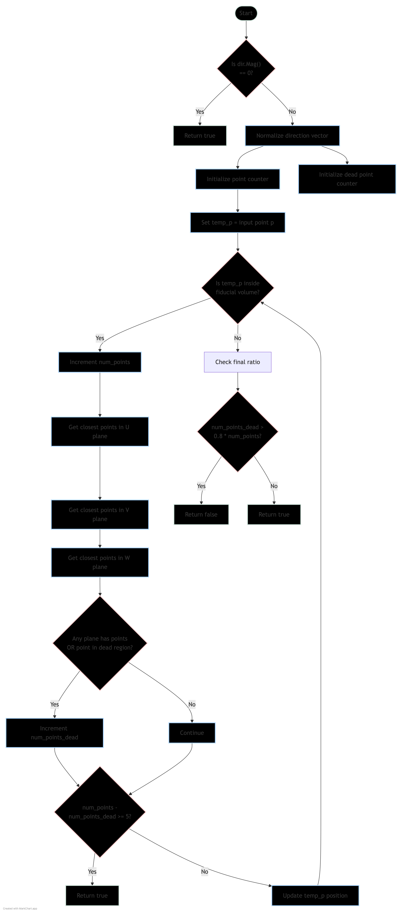

# ToyFiducial::check_signal_processing Documentation

## Function Purpose
The `check_signal_processing()` function checks whether there is sufficient signal along a given trajectory in the detector space by analyzing points and their proximity to reconstructed charge. This helps validate track reconstruction and identify potential issues with signal quality.

## Function Signature
```cpp
bool check_signal_processing(WCP::Point& p, TVector3& dir, WCP::ToyCTPointCloud& ct_point_cloud, 
                           double step = 1.0*units::cm, double offset_x = 0)
```

## Input Parameters
- `p`: A 3D point representing the starting position (WCP::Point)
- `dir`: Direction vector for the trajectory (TVector3)
- `ct_point_cloud`: Collection of charge points from reconstruction (WCP::ToyCTPointCloud)
- `step`: Step size for sampling points along trajectory (default: 1 cm)
- `offset_x`: X-coordinate offset to account for drift time (default: 0)

## Return Value
- Returns `true` if sufficient valid signal points are found along the trajectory
- Returns `false` if too many points are in dead/problematic regions

## Algorithm Logic

### Flow Diagram

The complete algorithm flow is visualized in [check_signal_processing_logic.md](check_signal_processing_logic.md):


1. **Initial Direction Check**
   - If direction magnitude is 0, return true (no direction specified)
   - Otherwise, normalize the direction vector

2. **Point Sampling**
   - Starting from input point `p`, steps along direction `dir`
   - Continues sampling while inside fiducial volume
   - Uses `step` size for incremental movement

3. **Signal Quality Check**
   - For each sampled point:
     - Checks proximity to charge points in U, V, W planes within 1.2 cm
     - Counts total points sampled and points in dead/problematic regions
     - If 5 good points found, returns true
   
4. **Final Assessment**
   - If > 80% of points are in dead/problematic regions, returns false
   - Otherwise returns true

## Example Usage

```cpp
// Example 1: Basic usage
WCP::Point start_point(10*units::cm, 20*units::cm, 30*units::cm);
TVector3 direction(1, 0, 0);  // Moving along x-axis
bool is_valid = fid.check_signal_processing(start_point, direction, cloud);

// Example 2: With custom step size and offset
WCP::Point start_point(10*units::cm, 20*units::cm, 30*units::cm);
TVector3 direction(0, 1, 0);  // Moving along y-axis
double step_size = 0.5*units::cm;
double x_offset = 5*units::cm;
bool is_valid = fid.check_signal_processing(start_point, direction, cloud, 
                                          step_size, x_offset);
```

## Points Data Structure Example
```cpp
// Example point cloud data structure for testing
WCP::ToyCTPointCloud cloud;
// Add points for U plane
cloud.add_point(WCP::Point(10*units::cm, 20*units::cm, 30*units::cm), 0);
// Add points for V plane
cloud.add_point(WCP::Point(11*units::cm, 21*units::cm, 31*units::cm), 1);
// Add points for W plane
cloud.add_point(WCP::Point(12*units::cm, 22*units::cm, 32*units::cm), 2);
```

## Common Usage Patterns

1. **Track Validation**
```cpp
// Validate reconstructed track direction
WCP::Point track_start = track->get_start_point();
TVector3 track_dir = track->get_direction();
bool is_track_valid = fid.check_signal_processing(track_start, track_dir, cloud);
```

2. **Multiple Direction Checking**
```cpp
// Check multiple possible directions from a point
std::vector<TVector3> possible_directions = {
    TVector3(1,0,0),
    TVector3(0,1,0),
    TVector3(0,0,1)
};

for(const auto& dir : possible_directions) {
    if(fid.check_signal_processing(point, dir, cloud)) {
        // Found a valid direction
        break;
    }
}
```

## Error Conditions

1. Invalid starting point (outside fiducial volume)
2. Zero magnitude direction vector (defaults to true)
3. Empty point cloud (will likely return false due to no signal points)

## Performance Considerations

- Function performs multiple geometric calculations per point
- Number of iterations depends on fiducial volume size and step size
- Point cloud lookup performance affects overall speed
- Consider increasing step size for better performance if high precision isn't needed

## Common Issues and Solutions

1. **All Points Failing**
   - Check if point cloud is populated
   - Verify starting point is inside fiducial volume
   - Confirm direction vector is normalized

2. **Unexpected False Results**
   - Check step size is appropriate for detector granularity
   - Verify point cloud density in region
   - Confirm x_offset is correct for drift time

3. **Performance Issues**
   - Increase step size
   - Optimize point cloud structure
   - Consider region of interest restrictions