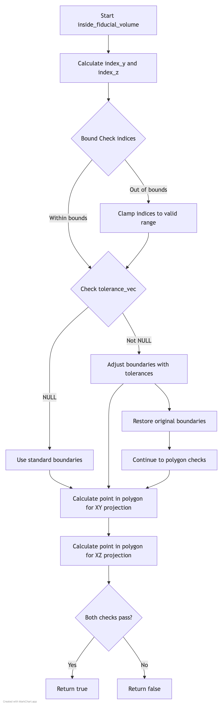

# Inside Fiducial Volume Check Documentation

## Overview
The `inside_fiducial_volume()` function determines whether a given point lies within the detector's fiducial volume, taking into account both the XY and XZ projections with optional tolerance parameters. The function is crucial for particle physics analysis as it helps identify whether particle interactions occur within the detector's trusted volume.

## Function Signature
```cpp
bool WCP2dToy::ToyFiducial::inside_fiducial_volume(
    WCP::Point& p,                   // Input point to check
    double offset_x,                 // X-axis offset
    std::vector<double>* tolerance_vec = NULL  // Optional tolerance parameters
)
```

## Inputs
1. **Point p**
   - Type: WCP::Point&
   - Description: 3D point containing (x, y, z) coordinates to check
   - Units: Typically in centimeters

2. **offset_x**
   - Type: double
   - Description: Offset to be subtracted from x coordinate
   - Usage: Adjusts for timing/drift effects
   - Units: Same as point coordinates (typically cm)

3. **tolerance_vec** (optional)
   - Type: std::vector<double>*
   - Description: Vector of tolerance values for boundary checks
   - Elements:
     - [0]: X tolerance (tx)
     - [1]: Y bottom tolerance (ty_bot)
     - [2]: Y top tolerance (ty_top)
     - [3]: Z tolerance (tz)
   - Default: NULL (no tolerance applied)

## Output
- Type: bool
- Value: true if point is inside fiducial volume, false otherwise

## Algorithm Steps

### Flow Diagram

The complete algorithm flow is visualized in [inside_fiducial_volume_logic.md](inside_fiducial_volume_logic.md):




1. **Index Calculation**
```cpp
int index_y = floor((p.y/units::cm+116)/24);
int index_z = floor(p.z/units::m);
```
- Calculates indices for boundary array lookup
- Bounds checking: 0 ≤ index_y ≤ 9 and 0 ≤ index_z ≤ 9

2. **Boundary Check Logic**
   - Without Tolerance:
     ```cpp
     c1 = pnpoly(boundary_xy_x, boundary_xy_y, p.x-offset_x, p.y);
     c2 = pnpoly(boundary_xz_x, boundary_xz_z, p.x-offset_x, p.z);
     ```

   - With Tolerance:
     - Adjusts boundary points by tolerance values
     - Performs point-in-polygon check with adjusted boundaries
     - Restores original boundary values

3. **Final Determination**
```cpp
return (c1 && c2);
```
- Returns true only if point is inside both XY and XZ projections

## Key Dependencies

1. **pnpoly Function**
```cpp
int pnpoly(std::vector<double>& vertx, std::vector<double>& verty, 
           double testx, double testy)
```
- Implements point-in-polygon algorithm
- Returns 1 if point is inside polygon, 0 if outside

2. **Boundary Arrays**
- `boundary_SCB_xy_x_array`: X coordinates for XY projection
- `boundary_SCB_xy_y_array`: Y coordinates for XY projection
- `boundary_SCB_xz_x_array`: X coordinates for XZ projection
- `boundary_SCB_xz_z_array`: Z coordinates for XZ projection

## Example Usage

```cpp
// Basic usage without tolerance
WCP::Point p(100.0, 0.0, 500.0); // point in detector coordinates
double offset_x = 10.0;
bool is_inside = fiducial.inside_fiducial_volume(p, offset_x);

// Usage with tolerance
std::vector<double> tolerances = {2.0, 1.0, 1.0, 2.0}; // in cm
bool is_inside_with_tolerance = fiducial.inside_fiducial_volume(
    p, offset_x, &tolerances
);
```

## Important Notes

1. **Coordinate System**
   - Uses detector coordinates
   - X: Drift direction
   - Y: Vertical direction
   - Z: Beam direction

2. **Boundary Definitions**
   - XY projection: Defines detector cross-section
   - XZ projection: Defines detector length
   - Both must contain point for it to be in fiducial volume

3. **Tolerances**
   - Positive tolerance increases accepted volume
   - Applied symmetrically to boundaries
   - Must be applied carefully to maintain detector physics

4. **Performance Considerations**
   - Function is called frequently during event reconstruction
   - Uses efficient point-in-polygon algorithm
   - Minimizes memory allocations

## Common Use Cases

1. **Track Containment**
   - Checking if particle tracks are contained
   - Identifying entering/exiting particles

2. **Vertex Selection**
   - Validating interaction vertices
   - Defining analysis volume

3. **Energy Deposit Analysis**
   - Ensuring energy deposits are within trusted volume
   - Background rejection

## Error Handling
- Bounds checking on array indices
- Graceful handling of NULL tolerance vector
- Preservation of boundary values when applying tolerances